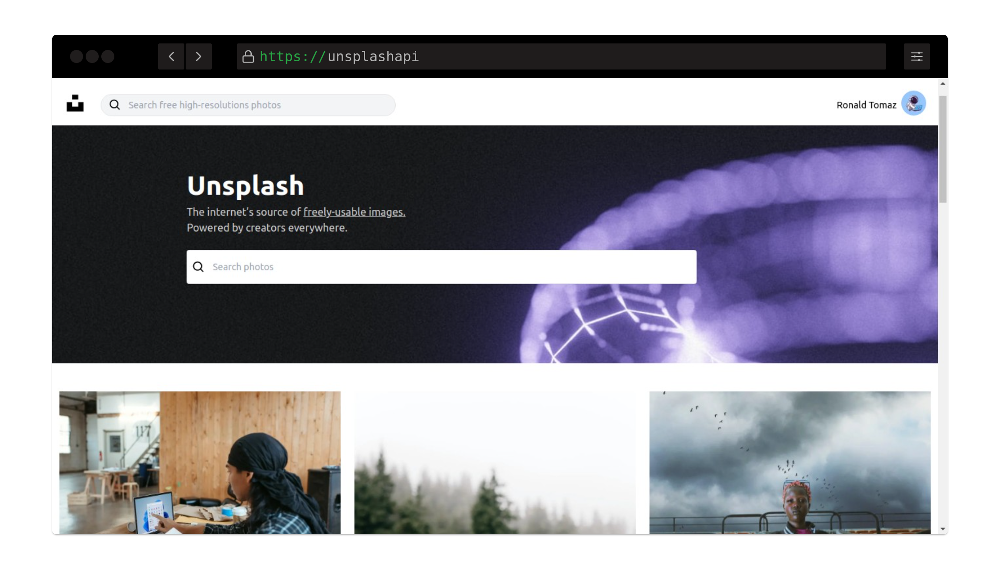
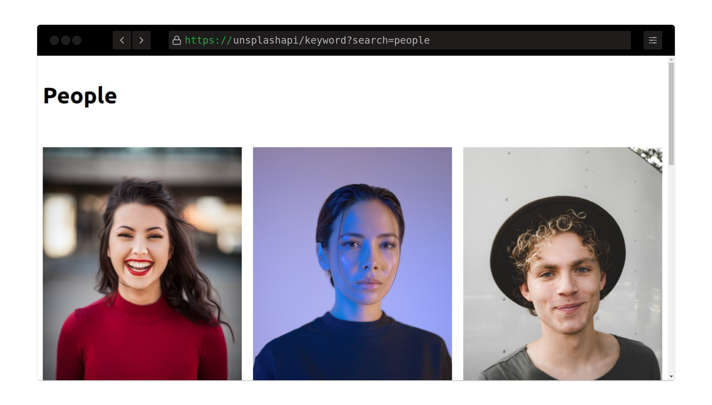
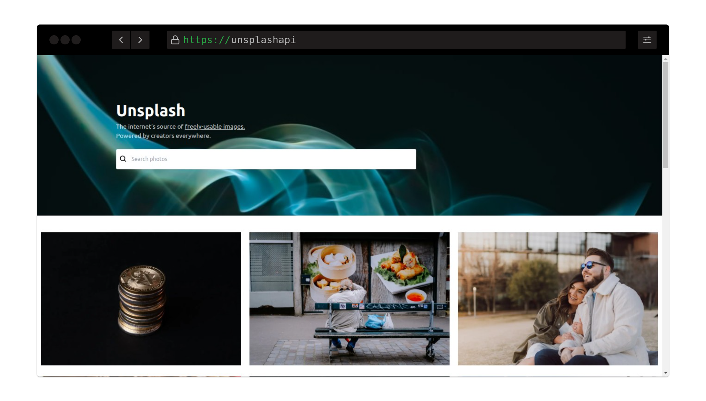

<h1 align="center">Unsplash</h1>

## Alert

Project in development.

## Project

Simulate some functionality of the Unsplash site through its developer api.

## Features

- Search a photo by keyword. ✅

Functionality created successfully, simply enter a keyword and search.

- List photos. ✅

Functionality created successfully, some images are randomly loaded on the homepage.

- Infinite scroll of images. (coming soon)

## Techs

- Next JS
- Typescript
- Tailwind CSS

## Resource

To use Unsplash api

- Go to [Unsplash Developers](https://unsplash.com/developers) and create your account.
- Create your app.
- Follow the documentation to start using the api.

## Usage

- Clone repo with `git clone https://github.com/ronaldprofile/unsplash-api.git`.
- Install dependencies with `yarn`.
- Execute the server with `yarn dev`.
